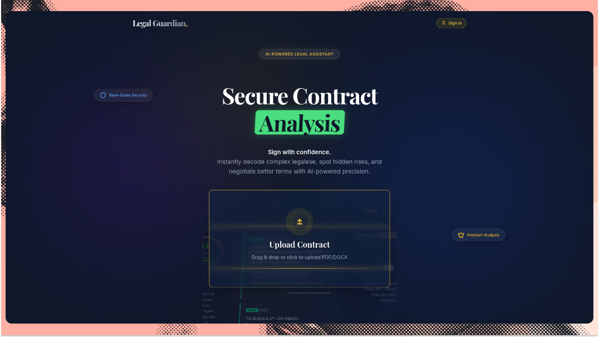

# ⚖️ Legal Guardian



**Translate Legalese into Human, then Negotiate like a Lawyer.**


Legal Guardian is an AI-powered platform designed to analyze legal documents (contracts, terms of service) to identify risks, explain complex clauses in simple terms, and automatically generate professional negotiation emails.

---

## 🚀 Features

- **📄 Document Upload:** Support for PDF and DOCX analysis.
- **🛡️ Analysis Dashboard:**
  - **Risk Score:** 0-100 evaluation of document "danger".
  - **Clause Breakdown:** Visual markers for Red Flags (High Risk) and Yellow Flags (Caution).
  - **Human Translation:** "Explain to me like I'm 5" version of any clause.
- **📧 The Negotiator:** Select problematic clauses and generate formal, legally-sound emails to request changes, citing relevant consumer protection laws.
- **📜 History:** Securely save and manage past document analyses.

---

## 🏗️ Architecture

This project is structured as a **Monorepo** to ensure type safety and code sharing across the stack.

- `apps/frontend`: Modern React application built with Vite and TailwindCSS.
- `apps/backend`: High-performance API powered by **Bun** and Clean Architecture.
- `packages/core`: Shared types, constants, and utilities.

---

## 🛠️ Tech Stack

- **Frontend:** React, TypeScript, TailwindCSS, Lucide Icons.
- **Backend:** Bun, Node.js, Clean Architecture.
- **Database:** MongoDB (Atlas).
- **AI:** OpenAI GPT Models.
- **Payments:** Stripe Integration.
- **Authentication:** JWT, Google OAuth, GitHub OAuth.

---

## 💻 Local Development

### Prerequisites

- [Bun](https://bun.sh/) installed.
- [pnpm](https://pnpm.io/) for workspace management.
- MongoDB instance (local or Atlas).

### Installation

1. Clone the repository:
   ```bash
   git clone <your-repo-url>
   cd legal-guardian
   ```

2. Install dependencies:
   ```bash
   pnpm install
   ```

3. Setup environment variables:
   - Create `.env.local` in `apps/backend` (use `.env.example` as reference).
   - Create `.env.local` in `apps/frontend`.

4. Run the development server:
   ```bash
   pnpm dev
   ```

---

## 🌐 Deployment (Render)

### Backend (Web Service)
- **Runtime**: `Bun`
- **Build Command**: `pnpm install`
- **Start Command**: `bun apps/backend/src/index.ts`
- **Environment Variables**: Set `MONGO_URI`, `OPENAI_API_KEY`, etc.

### Frontend (Static Site)
- **Build Command**: `pnpm install && pnpm --filter @legal-guardian/frontend build`
- **Publish Directory**: `apps/frontend/dist`
- **Environment Variables**: Set `VITE_API_URL` to your backend URL.

---

## 📄 License

This project is licensed under the [MIT License](LICENSE).

---

<p align="center">Made with ❤️ for a more transparent legal world.</p>
